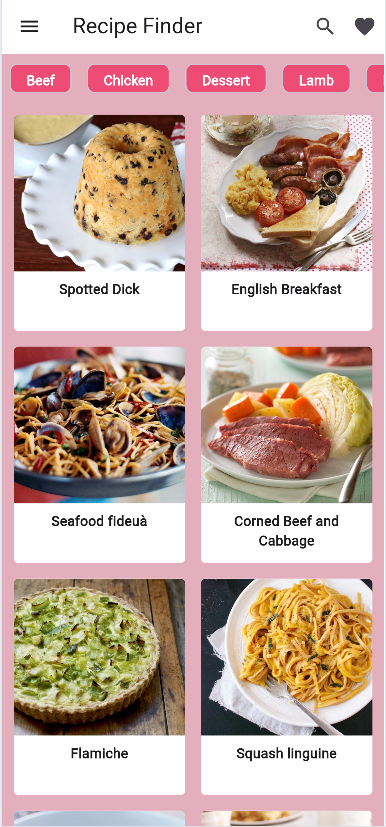
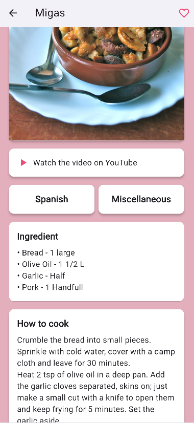
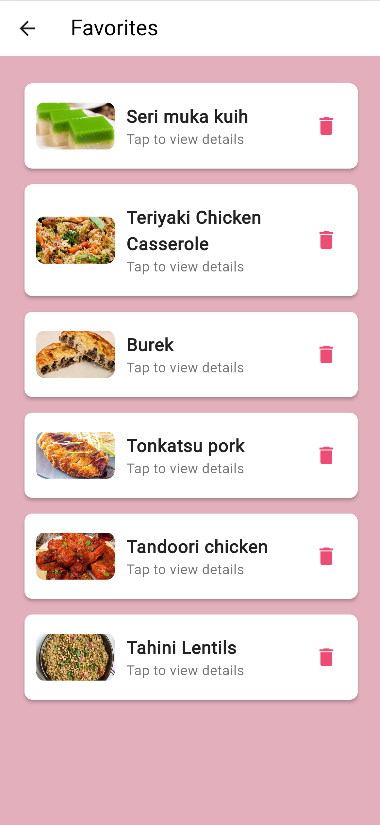
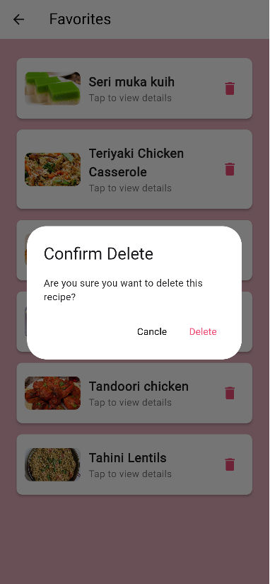
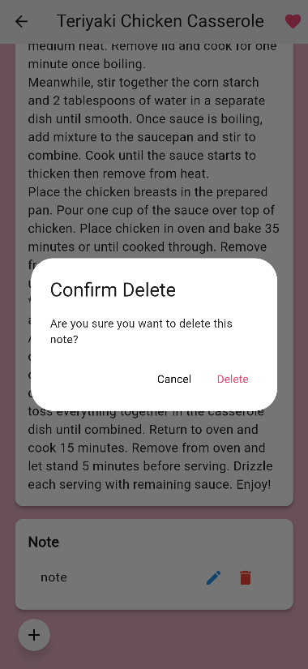

# 🍽️ แอปค้นหาสูตรอาหาร (Recipe Finder App)

## 📌 ภาพรวม
Recipe Finder App เป็นแอปพลิเคชัน **Flutter** ที่ทำงานร่วมกับ **Node.js + Express** และ **MongoDB** ให้ผู้ใช้สามารถค้นหาสูตรอาหารออนไลน์ ดูรายละเอียด และจัดการเมนูโปรดของตนเองได้

---

## 🛠️ คุณสมบัติ

✅ **ส่วนประกอบ UI ที่ใช้ใน Flutter**
- `Row`, `Column`, `ListView`, `GridView`, `Container`
- `Button`, `TextField`, `IconButton`, `Icon` ,`อื่นๆ`
- **หน้ารายละเอียด** พร้อมแสดง **รูปภาพ**
- **รองรับการ CRUD (Create, Read, Update, Delete)**

✅ **เชื่อมต่อ API ออนไลน์** ([TheMealDB](https://www.themealdb.com/))
- 🔍 ค้นหาสูตรอาหาร: `https://www.themealdb.com/api/json/v1/1/search.php?s=$query`
- 📌 ดูรายละเอียดอาหาร: `https://www.themealdb.com/api/json/v1/1/lookup.php?i=$idMeal`
- 🎲 สูตรอาหารแบบสุ่ม: `https://www.themealdb.com/api/json/v1/1/random.php`
- 🍤 ค้นหาตามหมวดหมู่ (อาหารทะเล): `https://www.themealdb.com/api/json/v1/1/filter.php?c=Seafood`
- 📂 รายการหมวดหมู่อาหารทั้งหมด: `https://www.themealdb.com/api/json/v1/1/categories.php`

✅ **ระบบล็อกอินและข้อมูลผู้ใช้**
- ใช้ `SharedPreferences` ในการจัดเก็บ **Token การเข้าสู่ระบบ** และข้อมูลผู้ใช้
- จำกัดการ **เพิ่มเมนูโปรด** จนกว่าผู้ใช้จะเข้าสู่ระบบ

✅ **จัดการเมนูโปรดและบันทึกโน้ต**
- ผู้ใช้สามารถ **เพิ่ม, ดู และลบ** เมนูโปรดของตนเองได้
- มี **Popup ยืนยัน** ก่อนลบเมนูโปรดหรือโน้ต

✅ **การจัดเก็บข้อมูล**
- **MongoDB** ใช้จัดเก็บข้อมูลสูตรอาหารมากกว่า **30+ รายการ**
- ใช้ **Express.js API** เชื่อมต่อกับฐานข้อมูล

---

## 📱 ตัวอย่างหน้าจอแอป
| หน้าแรก | หน้ารายละเอียด | เมนูโปรด |
|-----------|----------------|----------|
|  |  |  |


## 🧵 การแก้ไข
| หน้าแรก | การลบหน้าชื่นชอบ| การลบโน๊ต |
|-----------|----------------|----------|
|  |  |  |
- **Home** ไม่จำเป็นต้อง login ก็สามารถดู recipe ได้
- **การลบรายการชื่นชอบและโน๊ต** จะมีหน้าต่างยืนยันก่อนทำการลบ

## ❤ video การใช้งาน
---

## 🔧 วิธีติดตั้ง

### 🖥️ ฝั่ง Backend (Node.js + Express + MongoDB)
```sh
# โคลนโปรเจกต์
git clone https://github.com/enjoyer123/recipe_project-flutter.git
cd recipe_project-flutter/server

# ติดตั้งแพ็กเกจ
npm install

# ตั้งค่าตัวแปรสภาพแวดล้อม (.env)
MONGO_URI=your_mongo_connection_string
JWT_SECRET=your_secret_key

# รันเซิร์ฟเวอร์
npm start
```

### 📱 ฝั่ง Frontend (Flutter)
```sh
cd recipe_project-flutter/client

# ติดตั้งแพ็กเกจ
flutter pub get

# รันแอป
flutter run
```

---

